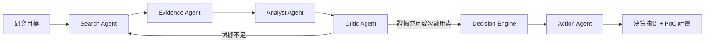

# R&D Intelligence Agent

## 問題與目標

技術選型的研究工作耗時且難以稽核。工程師要決定「該不該採用某個技術」時，通常得自行搜尋論文與開源專案、判讀彼此矛盾的結論、估算可行性，最後把這些整理成一份能說服團隊的提案。這個過程往往花掉數天，而且**結論與證據之間的連結很快就散失**——三個月後沒有人記得當初為什麼那樣決定。

R&D Intelligence Agent 把這個流程做成一條可稽核的自動化管線。使用者輸入一個研究目標，系統產出一份**每個主張都能回溯到原始出處**的技術決策與 PoC 執行計畫。

- **目標使用者**：需要做技術選型決策的研發團隊、技術主管、獨立開發者
- **預期影響**：把數天的調研壓縮到數十分鐘，並且讓決策的依據可以被第三者檢驗

專案的核心約束是**不得虛構**。系統寧可回報「證據不足」，也不產出無法回溯的結論。

## 核心功能

- **六個單一職責代理**：Search → Evidence → Analyst → Critic → Decision → Action，以型別化狀態溝通、彼此不直接呼叫（事件流上 Analyst 與 Critic 同屬 `analysis` 階段）
- **強制溯源**：每一張證據卡的引文都必須逐字出現在原始文獻中，否則整張卡片被拒收；引用不存在證據 ID 的研究方向會被丟棄
- **Critic 驅動的再搜尋迴圈**：Critic 找出證據缺口後產生針對性查詢，回頭再搜；迴圈次數有明確上限，用盡後強制以現有證據作結
- **六維機會評分**：以 RICE 結構與 NASA TRL 錨點為基礎，對每個候選方向計算 novelty、goal alignment、technical maturity、PoC feasibility、evidence strength、implementation difficulty，落選方向一併保存以供稽核
- **可執行的 PoC 計畫**：產出帶有工時估算、相依關係與可量測成功指標的任務清單
- **完整事件流**：每個階段的進展都以事件形式持久化，前端即時輪詢呈現，失敗與降級（來源不可用、限流、證據被拒）都會顯性回報

## 系統架構



各層如何協作：

| 層 | 內容 | 說明 |
| --- | --- | --- |
| **前端** | Next.js App Router | 建立任務、觸發執行、輪詢進度、呈現證據／評分／決策／計畫 |
| **API** | FastAPI + Pydantic | `POST /missions`、`POST /missions/{id}/run/async`、`GET /missions/{id}/workspace`、`GET /missions/{id}/events` |
| **編排** | LangGraph `StateGraph` | 型別化狀態、純函式路由、節點回傳部分更新；再搜尋迴圈與次數上限在圖上表達 |
| **代理** | 五個單一職責 Agent | 各自只認識自己的輸入輸出型別，彼此不直接呼叫 |
| **模型** | provider-independent `LLMClient` | 抽象介面，可換任何 OpenAI 相容供應商；另有確定性 mock 供離線測試 |
| **工具** | arXiv / GitHub 檢索 | 每個 host 獨立節流、指數退避、尊重 `Retry-After`，失敗降級為 `source_unavailable` 事件而非中斷流程 |
| **資料庫** | SQLite + SQLAlchemy | 任務、來源、證據卡、事件、機會評分、行動計畫；圖執行結束後紀錄仍完整可查 |

**兩個來源用不同的查詢語言**：arXiv 做全文相關性排序，吃自然語言長句；GitHub 對名稱與描述做關鍵字 AND 比對，長句必然零結果。因此 Search Agent 分別產出兩組查詢。

## 使用技術

| 類型 | 技術／服務 | 用途 |
| --- | --- | --- |
| AI 模型 | 任何 OpenAI 相容的 Chat Completions 供應商 | 六個代理的結構化推理；已實測 `gemini-3.1-flash-lite` 與 `MiniMaxAI/MiniMax-M3` |
| AI 編排 | LangGraph 1.2 | 型別化狀態圖、有界再搜尋路由 |
| 前端 | Next.js 16 · React 19 · TypeScript 5 | 任務工作區、執行控制、進度輪詢、結果呈現 |
| 前端測試 | Vitest · Testing Library · jsdom | 元件與 API 層測試 |
| 後端 | FastAPI 0.141 · Pydantic · Uvicorn | HTTP API 與型別化契約 |
| 資料庫 | SQLAlchemy 2.0 · SQLite | 任務、證據、事件、決策與計畫的持久化 |
| 後端測試 | pytest · ruff | 302 個測試、lint 與格式檢查（CI 強制） |
| 外部資料 | arXiv API · GitHub REST Search API | 論文與開源專案檢索 |
| Sponsor 技術 | GMI Cloud（推論服務） | 以 OpenAI 相容端點提供 MiniMax-M3 推論，供六個代理的結構化生成使用 |


## 安裝與執行

需求：Python 3.11+（開發於 3.13.7）、Node.js 20.9+（開發於 22.14.0）、npm 10+。

**離線模式不需要任何 API 金鑰**，可完整重現整條流程 —— `backend/.env.example` 原樣複製即可執行。改成線上模式（真實模型 + 真實 arXiv／GitHub 檢索）的步驟見下方。

```bash
# 1. 取得原始碼
git clone https://github.com/hudson9432/rd-intelligence-agent.git
cd rd-intelligence-agent

# 2. 後端
python3 -m venv .venv
source .venv/bin/activate            # Windows: .venv\Scripts\activate
pip install -r backend/requirements.txt
cp backend/.env.example backend/.env # 原樣即可離線執行，不需金鑰

cd backend
python -m pytest                     # 302 passed
python -m uvicorn app.main:app --port 8000
```

```bash
# 3. 前端（另開一個終端機）
cd frontend
cp .env.example .env.local
npm install
npm test                             # 29 passed
npm run dev                          # http://localhost:3000
```

開啟 <http://localhost:3000>，建立任務後按 **Start research** 即可執行。

### 切換到線上模式

編輯 `backend/.env`：

```bash
MOCK_LLM=false
LLM_BASE_URL=https://api.example.com/v1     # 任何 OpenAI 相容端點
LLM_API_KEY=<你的金鑰>
LLM_MODEL=<模型名稱>

MOCK_EXTERNAL_APIS=false                    # 改為真實 arXiv / GitHub 檢索
GITHUB_TOKEN=<選填，將搜尋額度由 10 提升到 30 次／分鐘>
```

供應商差異很大，以下三項建議依實際情況調整：

```bash
LLM_REQUEST_TIMEOUT_SECONDS=180             # 推理型模型單次可能超過一分鐘
LLM_MAX_OUTPUT_TOKENS=8192                  # 預設 4096 會讓結構化輸出被截斷
LLM_MIN_REQUEST_INTERVAL_SECONDS=4.0        # 依供應商的每分鐘上限調整
```

### 調整單次任務的時間

線上完整跑一次約 30 分鐘，其中證據抽取佔 52%、分析佔 32%。有人在旁邊看的
展示場景，用這兩個參數換取時間：

```bash
WORKFLOW_MAX_ITERATIONS=1        # 預設 2。每一輪都是一次搜尋＋抽取＋分析
SEARCH_MAX_RESULTS_PER_SOURCE=3  # 預設 8。抽取是每筆來源一次模型呼叫
```

兩者一起調，一次任務約 10 分鐘。代價是證據較少、只補搜一次，結論會比較薄——
適合展示，不適合真的拿來做決定。

命令列執行一次完整任務：

```bash
curl -X POST http://127.0.0.1:8000/missions \
  -H "Content-Type: application/json" \
  -d '{"title":"RAG reliability","goal":"Decide whether retrieval augmented generation is reliable enough for our product."}'

curl -X POST http://127.0.0.1:8000/missions/<mission-id>/run/async
curl http://127.0.0.1:8000/missions/<mission-id>/workspace
```

## 作品展示

- 作品展示網址（選填）：
- 評選影片：<!-- TODO -->

## 限制與未來工作

### 已知限制

- **離線 Demo Mode 尚未完成**（Phase 14）。目前 `MOCK_EXTERNAL_APIS=true` 只對特定主題的凍結回應有意義，換題目會取得不相干的來源。
- **證據抽取會有約 5% 的拒收率**。模型偶爾改寫或省略引文，溯源檢查會整張拒收。這是刻意的取捨——寧可少一張證據，不留來路不明的引文——但確實減少可用證據。
- **外部服務限流**。arXiv 與 GitHub 都會限流；系統以退避與降級處理，不會中斷，但該輪的來源會減少。
- **只實測過兩家模型供應商**。抽象介面是 provider-independent 的，但跨供應商的實測僅涵蓋 Gemini 與 MiniMax-M3。
- **無身分驗證與多使用者隔離**。API 與前端目前假設單一本機使用者。
- **成本未計量**。系統不追蹤 token 用量或費用。

### 後續方向

- 完成離線 Demo Mode，讓評選與展示不依賴外部服務可用性
- 擴充來源（Papers with Code、Semantic Scholar、產業技術報告）
- 決策紀錄的版本比較：同一目標在不同時間點的結論差異
- Phase 12：使用者核可後將 PoC 任務寫入行事曆／專案管理工具

## 第三方服務、資料與素材

| 項目 | 來源 | 用途 | 授權／條款 |
| --- | --- | --- | --- |
| arXiv API | <https://info.arxiv.org/help/api/> | 論文檢索與摘要 | [Terms of Use](https://info.arxiv.org/help/api/tou.html)；遵守其節流要求 |
| GitHub REST Search API | <https://docs.github.com/rest/search> | 開源專案檢索 | [GitHub ToS](https://docs.github.com/site-policy/github-terms/github-terms-of-service) |
| LangGraph | <https://github.com/langchain-ai/langgraph> | 代理編排 | MIT |
| FastAPI | <https://github.com/fastapi/fastapi> | HTTP API | MIT |
| SQLAlchemy | <https://github.com/sqlalchemy/sqlalchemy> | ORM | MIT |
| Pydantic | <https://github.com/pydantic/pydantic> | 型別化契約 | MIT |
| Next.js | <https://github.com/vercel/next.js> | 前端框架 | MIT |
| React | <https://github.com/facebook/react> | UI | MIT |
| `demo/fixtures/` 內的凍結回應 | 由 `demo/capture_fixtures.py` 從 arXiv／GitHub 實際擷取 | 離線重現 | 內容版權屬原作者；僅供本專案離線測試 |

`demo/fixtures/` 的內容是**真實 API 回應的存檔**，不是手寫的假資料——為真實論文捏造摘要違反本專案的不得虛構原則。

**本儲存庫不含任何金鑰、Token 或個人資料。** `backend/.env` 與 `frontend/.env.local` 均在 `.gitignore` 中，僅提供 `.env.example` 範本。

## 團隊成員

| 姓名 | 分工 |
| --- | --- |
| 陳昊呈 |  工作流狀態機、AgentEvent、PoC Action Plan |
| 吳東儒 |  機會分析、評分、coverage、re-search決策 |
| 黃書聖 |  Mission UI、進度呈現、結果頁、整合與 Demo |
| 李坤益 |  Provider abstraction、結構化輸出、Evidence Agent |
| 李威廷 |  arXiv、GitHub 搜尋、去重、Mock fixtures |


## License

本專案採用 [MIT License](LICENSE)。
