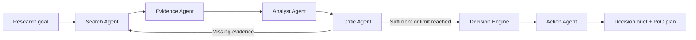

# Architecture

## Product loop

R&D Intelligence Agent transforms an open-ended research goal into a defensible
decision and a small executable PoC plan.

## Components

- **Frontend:** Next.js and TypeScript dashboard for missions, progress, evidence,
  decisions, and action plans.
- **API:** FastAPI endpoints with Pydantic request/response contracts.
- **Services:** application operations and provider-independent interfaces.
- **Agents:** narrow roles that consume and return typed state.
- **Tools:** deterministic source retrieval, parsing, hashing, deduplication, and
  optional workflow integrations.
- **Persistence:** SQLite with repository abstractions for the MVP.
- **Orchestration:** planned LangGraph typed state graph with bounded re-search.

## Data flow rules

- A `ResearchMission` owns sources, evidence, opportunities, coverage reports,
  a decision, an action plan, and an ordered event stream.
- Source records retain their original URL and normalized content hash.
- Evidence cards point to their source; opportunities and decisions point to
  evidence IDs.
- LLM structured output is validated before persistence.
- Numeric opportunity scores and coverage thresholds are calculated in code.
- Providers are selected from environment configuration and have deterministic
  mocks for tests/demo.

## Failure model

An unavailable source or malformed LLM response becomes a recorded, typed error.
Existing workflow state is preserved. The orchestrator continues only when the
remaining evidence can support a meaningful result, and every retry/iteration
is bounded.
